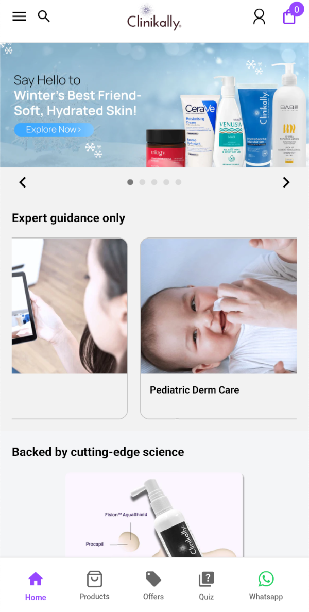
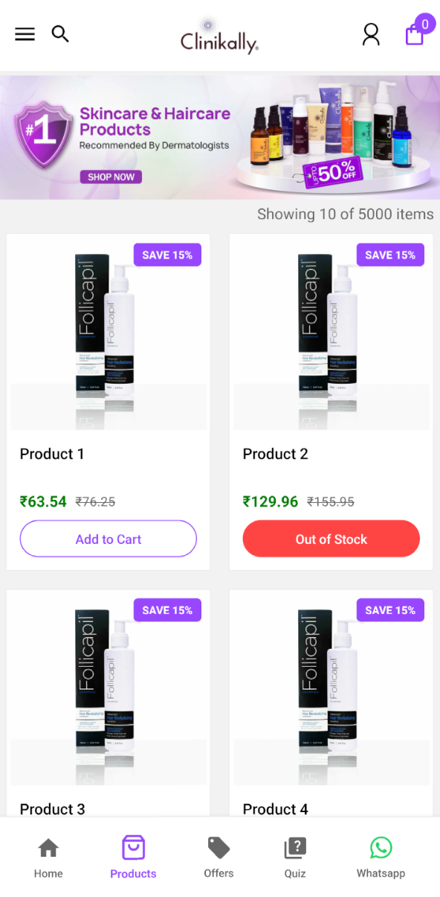
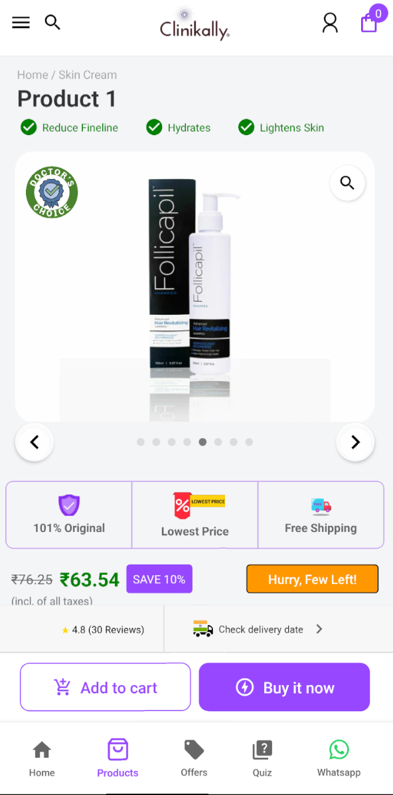
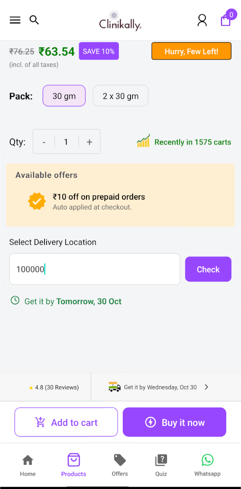

# Clinikally Project - Your Seamless Healthcare Companion

Clinikally is a cutting-edge React Native application that revolutionizes the healthcare experience. With its intuitive user interface and a range of innovative features, Clinikally empowers users to effortlessly manage their healthcare needs.

## Getting Started

To set up the Clinikally project, follow these simple steps:

1. Clone the repository: `git clone https://github.com/Avenster/clinikally-project.git`
2. Navigate to the project directory: `cd clinikally-project`
3. Remove the existing `node_modules` folder and `package-lock.json` file: `rm -rf node_modules && rm package-lock.json`
4. Install the dependencies: `npm install`
5. Run the application on your desired platform: `npm run <your_platform>` (replace `<your_platform>` with either `ios` or `android`)

## Application Screenshots

Clinikally offers a seamless and intuitive healthcare experience. Explore the key features through the following screenshots:

  

    
    
Home Screen

  

  

    
    
Product List Screen

  

  

    
    
Product Details Screen

  

  

    
    
Pincode Testing

  

Clinikally is a one-stop destination for all your healthcare needs, offering a wide range of skin care and wellness products. With its intuitive interface and seamless user experience, Clinikally aims to revolutionize the way you manage your healthcare journey.

## Getting Timer and Date

Clinikally's innovative features include a built-in timer and date functionality, empowering users to track their healthcare routines and manage their schedules effortlessly.

## Contributing

We welcome contributions to the Clinikally project. If you'd like to get involved, please follow the guidelines outlined in the [CONTRIBUTING.md](CONTRIBUTING.md) file.